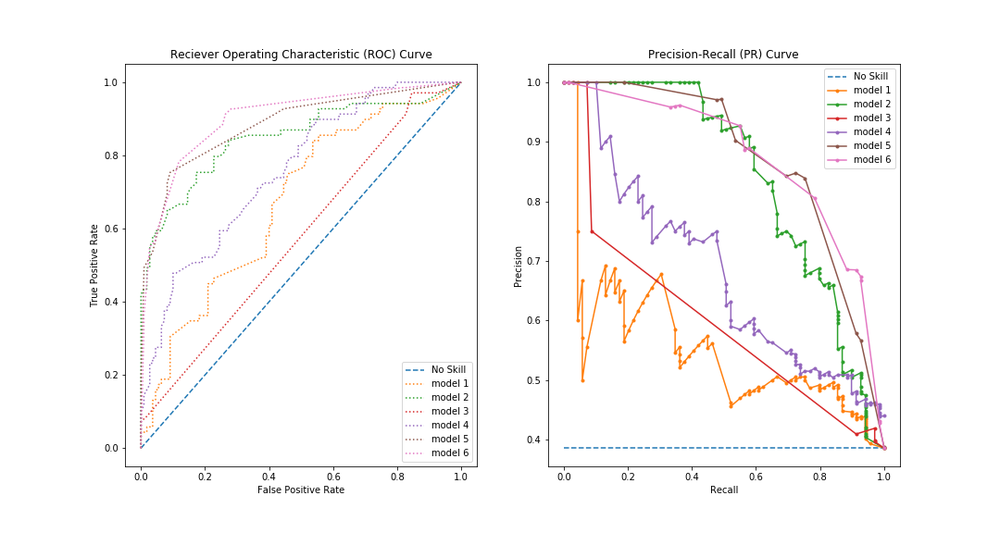

The purpose of this project was to attempt to build a valid machine learning model to be able with the highest capacity determine the survival rate of Titanic passengers provided by the [Kaggle Titanic Challenge](https://www.kaggle.com/c/titanic).

Since the outcome is binary (survived/not survived) Logistic Regression was initially employed for model building. Also used Decision Tree and Random Forest in an attempt to improve model accuracy.

Feature engineering and Hyperparameter Optimization were used in an attempt to build the best possible model.

For this present analysis, a particular emphasis was placed on custom building functions that automate Receiver Operating Characteristic (ROC) curve along with Precision-Recall curve production for several machine learning model at a time. Therefore, machine learning model assessment is based primarily on what these graphs reveal.

The following ROC and precision-recall curves show the various models attempted for the most part correctly predicted passenger survival rate: 

Models in ROC and PR curves (algorithm and features used):

- all were built with random forest algorithm
- model 1: Pclass, Age, SibSp, Parch
- model 2: Miss\*Pclass, Fare\*Pclass, Female\*Pclass
- model 3: Mr\*SibSp\*Pclass, Mrs\*Parch\*Pclass
- model 4: Pclass, S, Q, C, Fare
- model 5: Miss, Mrs, toddler, adolescent, Class 3
- model 6: Mr, Master, toddler, adolescent, Class 3, Class 1
