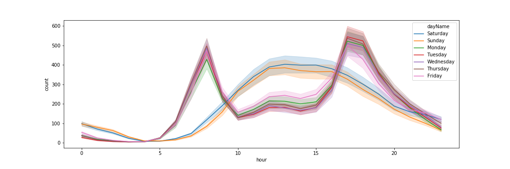

### General Background

The purpose of this project is to build a machine learning model to predict the number of bikes needed at any given time in Washington D.C. for their bikesharing market [kaggle challenge](https://www.kaggle.com/c/bike-sharing-demand/data). This is broken down into exploratory data analysis (EDA), features selection, modeling and evaluating assumptions (in each respective jupyter notebook).

### EDA

Initial analysis demonstrated visible behavioral difference between casual and registered bike users:

Initial analysis also demonstrated that temperature fluctuated most bike rental count:

### Feature Selection

This analysis demonstrated that hour, workingday,  atemp, humidity, month,  and holiday are the most significant factors and should be included in modeling.

### Modeling

Many different combinations of features were used for linear regression, decision tree and random forest modeling. The specific features for each group are as follows:

- noAnalysis: season, holiday, workingday, weather, temp, atemp, humidity, windspeed, month, day, hour
- EDA: hour, atemp, humidity, month, workingday, holiday
- Interact*: mJulHol, mJunWD, mJultemp, mJulHum, 8h, 18h
- EDA + Interact: hour, atemp, humidity, month, workingday, holiday, mJulHol, mJunWD, mJultemp, mJulHum, 8h, 18h
- noAnalysis + EDA + Interact: season, holiday, workingday, weather, temp, atemp, humidity, windspeed, month, day, hour, hour, atemp, humidity, month, workingday, holiday, hour, atemp, humidity, month, workingday, holiday, mJulHol, mJunWD, mJultemp, mJulHum, 8h, 18h

\* quick note: an idea of a former Classmate [Julia](https://github.com/julisep), certain months and hours of day that had high peaks in bike rental count were emphasized by placing higher emphasis on them via a sort of one-hot encoding technique. See featEng() function in modeling notebook for better understanding.

The respective r^2 and RMSLE score were calculated for quantifying success of each model:

Linear Regression:

Decision Tree:

Random Forest:

As can be seen from the graphs above, decision tree had the bet RMSLE but demonstrated possible overfitting. The next best model to use would be random forest with noAnalysis.

### Evaluating Assumptions

Seven main assumptions were assessed to validate the linear regression model used for this project:

1. Linear Relationship: observed a general linear relationship between bike rental count (dependent variable) and all other variables (independent variables).

2. Random sampling: couldn't be checked since not involved in data collection, but assume this is true.

3. Sample variation in all independent features: all features had more than 1 unique values, so this assumption is true.

4. Zero Conditional Mean: This was evaluated my mapping the residuals in a scatter plot and heatmap. Scatterplots showed no consistent pattern, but the heat map showed an apparent correlation between 18h/hour and mJultemp/atemp.

5. Homoscedasticity: used the Breusch-Pagan test to determine whether there is even residual variance across all dependent variables. With a very low p-value, the test demonstrates that there is heteroskedasticity in the model.

6. Normally distributed residuals: Examined residuals with a histogram and q-q plot. Both visually indicate a normal residual distribution. But when evaluating the residuals with the Jarque-Bera test, the null hypothesis was rejected and therefore couldn't confidently conclude residuals are normally distributed.

7. Multicolinearity: Initially used OLS regression results, which concluded the smallest eigen value indicates the possibility of multicollinearity. Variance inflation factor was also calculated, finding the factor of the hour feature to be too high.

The evaluation of the 7 assumptions, assumptions 1-4 indicate that the linear regression model will provide with an unbiased estimate of the coefficients, which then returns an unbiased y-pred estimates. With assumption 5 not being held true, the model can't confidently predict outcome values. With assumptions 6-7 not being true, the effect size can't be relied on.  
