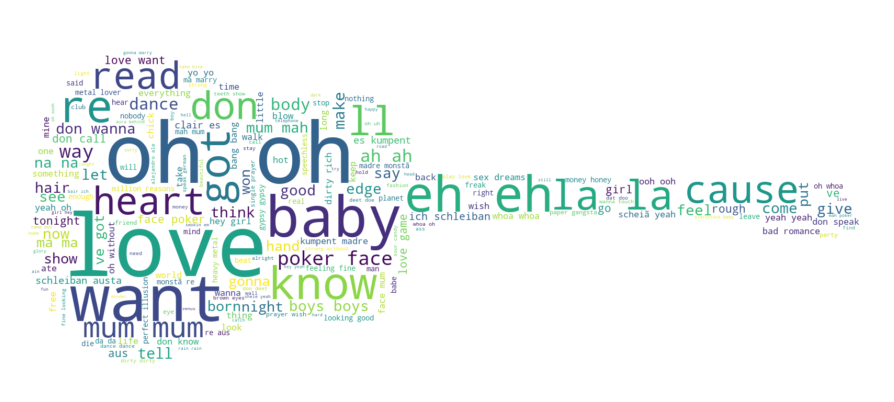
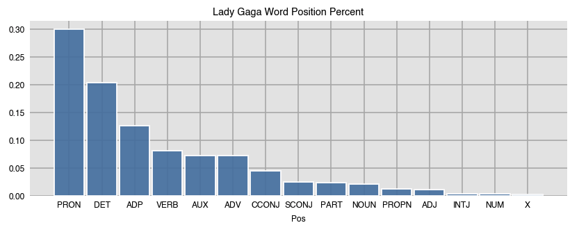
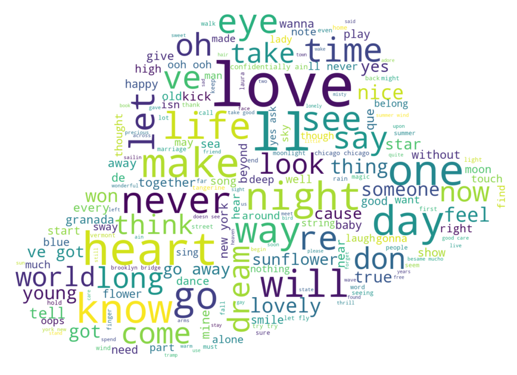
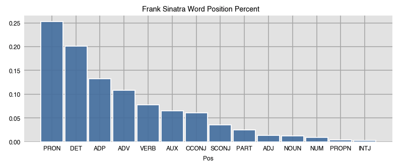
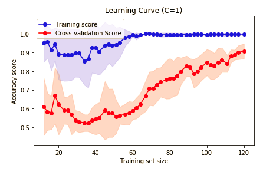
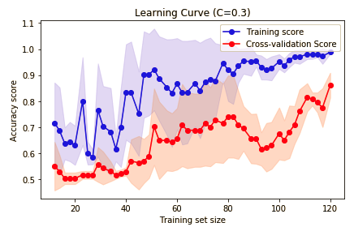

### General Background

The purpose of this project was to build a text classification model to predict the artist based on a piece of text. Lyrics of 2 artists, Lady Gaga and Frank Sinatra, were scraped from [metrolyrics](https://www.metrolyrics.com/), as detailed in [lyric_collection](notebooks/lyric_collection.ipynb). The lyrics were then cleaned for brief analysis in [eda notebook](notebooks/EDA.ipynb). And finally, the lyrics were numerically vectorized using Bag of Words method for model building and evaluation in [modelling notebook](notebooks/modelling.ipynb).

### Exploratory Data Analysis

 Lady Gaga lyrics were cleaned, tokenized and vectorized for some structural analysis. An initial look at tokenized word frequency is demonstrated in this word cloud:

 

 [Spacy](https://spacy.io/usage) library was used to tokenize, cleanup and identify each words "grammatical role" within each lytic. The frequency of types of words used by Lady Gaga in her lyrics are visualized here:

 

 The same was done for Frank Sinatra lyrics, with the word cloud here:

 

 and use of word type here:

 

based on this brief analysis it's demonstrated that despite the artists originating from different generations and eras, they have similar word usage and grammatical types of words.

### Model evaluation

With cleaned up and vectorized lyrics, the 2 sets were concatenated together to build a Naives Bayes model for text classification. To evaluate the accuracy of the model, learning curves were found to be the most reliable validator. With experimenting with different hyperparameters, it was concluded adjusting the regularization strength (C) optimized the model to be more general as opposed to just being specific to the training data. Here is when the inverse of the regularization strength is left at default:

Here with the inverse regularization strength left at default 1, the training score accuracy experiences little change with increase in training set size and an early plateau effect. This shows an overfitting of the model to the training data. Below depicts what occurs when the inverse regularization strength is adjusted:

  

When the model is more regularized (decrease of inverse regularization strength), the training accuracy score varies more and increases with increasing size of the training set size. With the model regularized, the model is not overfitting to the training data and is more generalizable. This also demonstrates in general how learning curves are good visual tool to detect model overfitting.    
