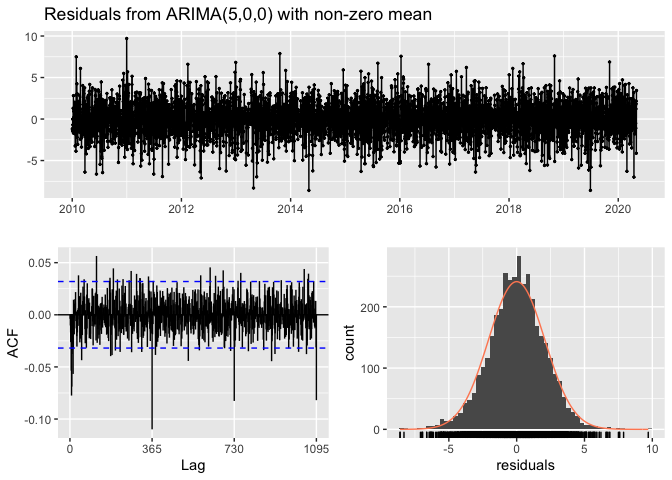

``` r
library(lubridate)
library(dplyr)
library(ggplot2)
library(forecast)
library(tseries)
```

### Import and Cleanup Data

``` r
tempelhof=read.table("TG_STAID002759.txt", skip=20, 
                     col.names=c("SOUID", "date", "temp", "Q_TG"), sep=',')

tempelhof= tempelhof %>% select(date, temp) %>% mutate(date=ymd(date)) %>% mutate(temp=temp/10) %>% 
    filter(between(date, as.Date("2010-01-01"), as.Date("2020-04-30")))

head(tempelhof, 10)
```

    ##          date temp
    ## 1  2010-01-01 -1.4
    ## 2  2010-01-02 -1.7
    ## 3  2010-01-03 -4.3
    ## 4  2010-01-04 -5.6
    ## 5  2010-01-05 -6.0
    ## 6  2010-01-06 -6.9
    ## 7  2010-01-07 -5.3
    ## 8  2010-01-08 -5.6
    ## 9  2010-01-09 -2.3
    ## 10 2010-01-10 -3.4

**check data looks similiar as in python**

``` r
tempelhof2=ts(tempelhof$temp, start=c(2010,1), frequency=365)

autoplot(tempelhof2)+ ggtitle("Daily Berlin Tempelhof Temperature 2010-2020") + 
    theme(plot.title = element_text(hjust = 0.5))
```


### Stationarize Data

-   removes seasonality (`seassadj()`) and trend ('diff()') from decomposed (`stl()`) data

``` r
stationed=tempelhof2 %>% stl(s.window='periodic') %>% seasadj() %>% diff()

ggtsdisplay(stationed, main="", lag.max=60)
```


### Grid Search for Hyperparameter Optimization

``` r
ARIMAfit=auto.arima(stationed, approximation=F, trace=F)

summary(ARIMAfit)
```

    ## Series: stationed 
    ## ARIMA(5,0,0) with zero mean 
    ## 
    ## Coefficients:
    ##          ar1      ar2      ar3      ar4      ar5
    ##       0.0783  -0.2449  -0.1320  -0.0717  -0.1015
    ## s.e.  0.0162   0.0162   0.0166   0.0162   0.0162
    ## 
    ## sigma^2 estimated as 4.317:  log likelihood=-8108.13
    ## AIC=16228.26   AICc=16228.28   BIC=16265.67
    ## 
    ## Training set error measures:
    ##                       ME   RMSE      MAE      MPE     MAPE      MASE
    ## Training set 0.002769191 2.0763 1.611263 86.01427 261.2615 0.6312976
    ##                      ACF1
    ## Training set -0.003831657

``` r
model=Arima(stationed, order=c(5,0,0))

checkresiduals(model)
```



    ## 
    ##  Ljung-Box test
    ## 
    ## data:  Residuals from ARIMA(5,0,0) with non-zero mean
    ## Q* = 931.29, df = 724, p-value = 2.62e-07
    ## 
    ## Model df: 6.   Total lags used: 730

**Based on the [documentation](https://otexts.com/fpp2/arima-r.html) the main take away point in the residual plot is that the residuals are not all white noise since not all autocorrelations are within threshold limits in ACF plot.**

### Forecasting 90 days into future

-   slight improvement to python
-   below show the forecast is ineffective after the 5th day

``` r
forecast=data.frame(forecast(model, h=90))

head(forecast$Point.Forecast, 15)
```

    ##  [1]  0.730310029 -0.323831347 -0.424853033  0.230864877 -0.125342610
    ##  [6] -0.058109864  0.062083721  0.065285024 -0.013786036 -0.005291027
    ## [11] -0.001124623 -0.004872184 -0.001963467  0.006048406  0.005297195

``` r
autoplot(forecast(model, h=90)) + xlim(c(2020.0, 2020.4))
```


