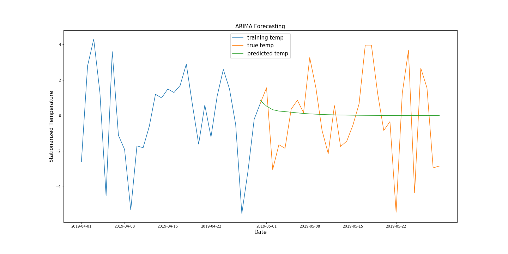

### General

The goal of this week's project is to understand Time Series analysis and the time dependence on time series data. The data used for this analysis was acquired with explicit permission from the [European Climate Assessment & Dataset](https://www.ecad.eu/). Daily weather measurements were downloaded for Berlin Tempelhof. The raw data for the analysis is not available in this repository for permission is given to download and use the data for practice/learning but for redistribution. Broke down data processing and analysis into several jupyter notebooks. For forecasting, built: naive, auto regression, ARIMA and Prophet. All modeling was possible in python except for ARIMA, therefor this was done again in R and report can be read [here](ARIMA_R.md).

### Exploratory Data Analysis

For all analysis and modeling, only temperatures from January 1, 2010 to April 30, 2020 at Berlin Tempelhof were used. A quick look at temperature distribution indicates that there maybe trend in the data (boxplot by month) but not likely seasonality (boxplot year).

### Modeling

1. Naive Model

Model built as a baseline comparison against all other models. Predicted temperature based on seasonal mean.

2. Auto-regression

Auto-Regression model built using LinearRegression algorithm from sklearn package in python. The AIC score for this model is 15043.13. By visually inspecting the graph above, it appears the model was pretty successful in predicting temperature.

3. ARIMA

The image above is a result of building an ARIMA model in python using the statsmodel package. The AIC score is 14753.31. As can be seen in the graph above, there is little fluctuation in the first couple of days of predicted temperature, even with using a grid search for finding optimal ARIMA model parameters (p,q,d).

Image above shows results of building an ARIMA model with the same data in R, as shown in [this markdown file](ARIMA_R.md). Model had an AIC score of 16228.26. It was determined the ARIMA modeling was better in R due to a more realistic fluctuation in predicted temperature for the first 5 days. The predictions flatten out after about 7 days, but this is a common result of this type of model in general.

4. facebook Prophet

Prophet](https://facebook.github.io/prophet/docs/quick_start.html#python-api) package was used as well for temperature forecasting and as can be seen from above, produced the the most optimal results. Not explicitly demonstrated above but easily visible in the corresponding [jupyter notebook](Prophet.ipynb), the prophet package was able to extract components from the data and determine that there was a steady rise in temperature (trend) throughout the 10 year period. It also determined that the highest temperatures were in July and August of each year (unsurprising) and that temperature on a Thursday and Friday contributed the most to temperature (perhaps fluctuation?) in the data. Based on cross-validation done using the package, MAPE score showed that temperature predictions the model did are the most accurate up to 50 days in the future (horizon).

### To do

* run ARIMA python in google co-lab to see if this will improve results
* improve rolling ARIMA
* attempt walk-forward validation for ARIMA in python 
